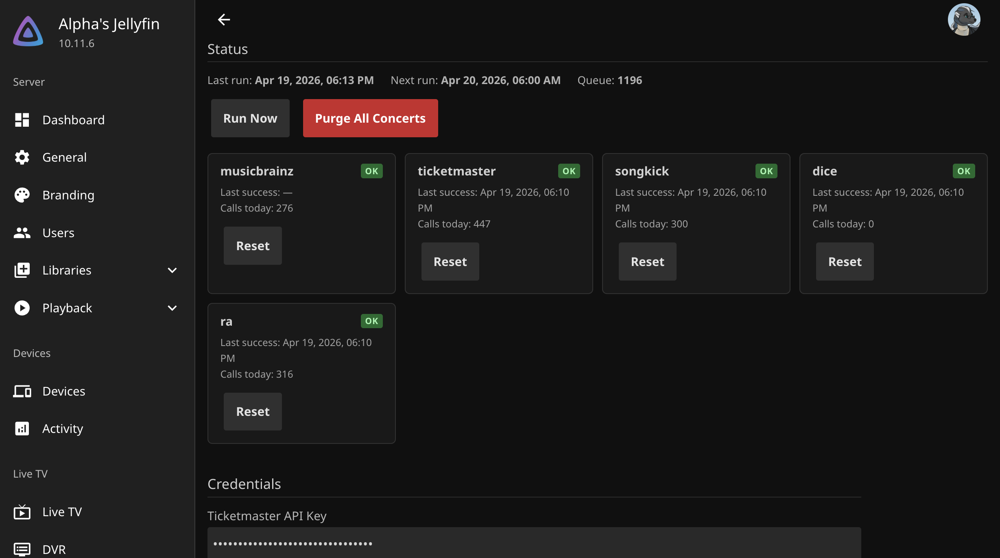
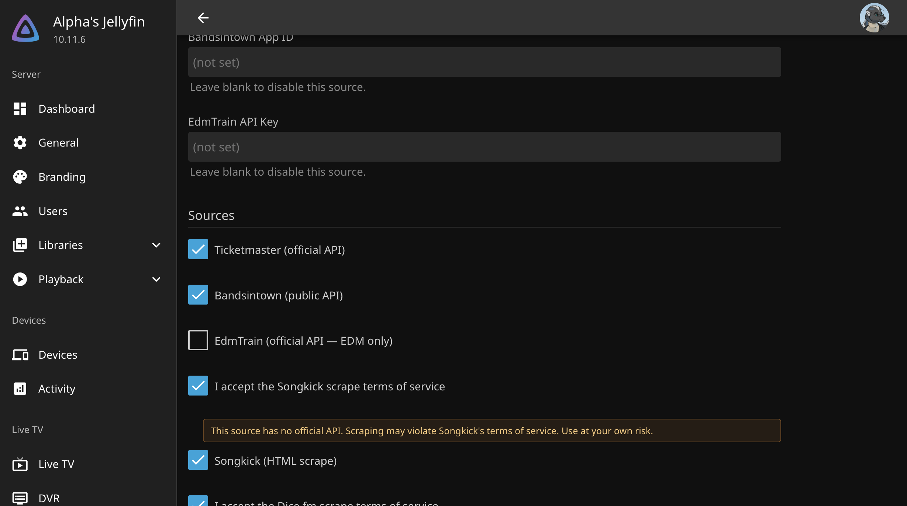
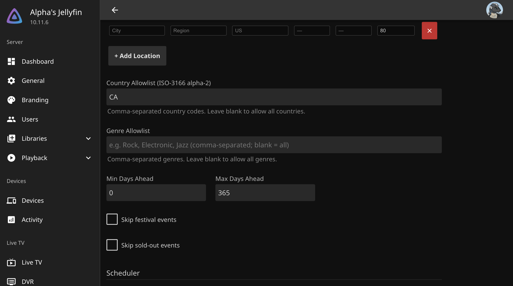
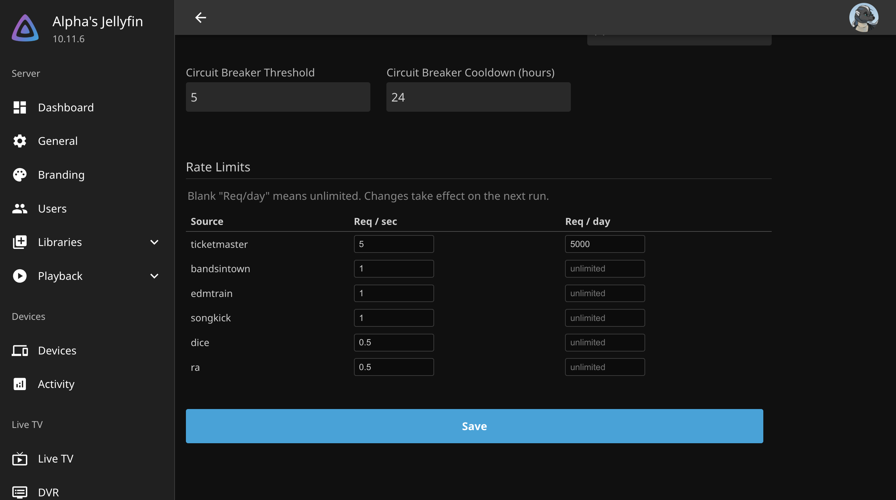
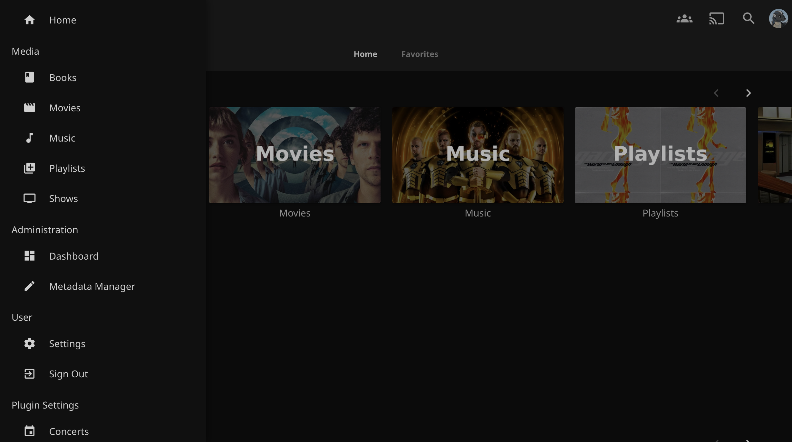
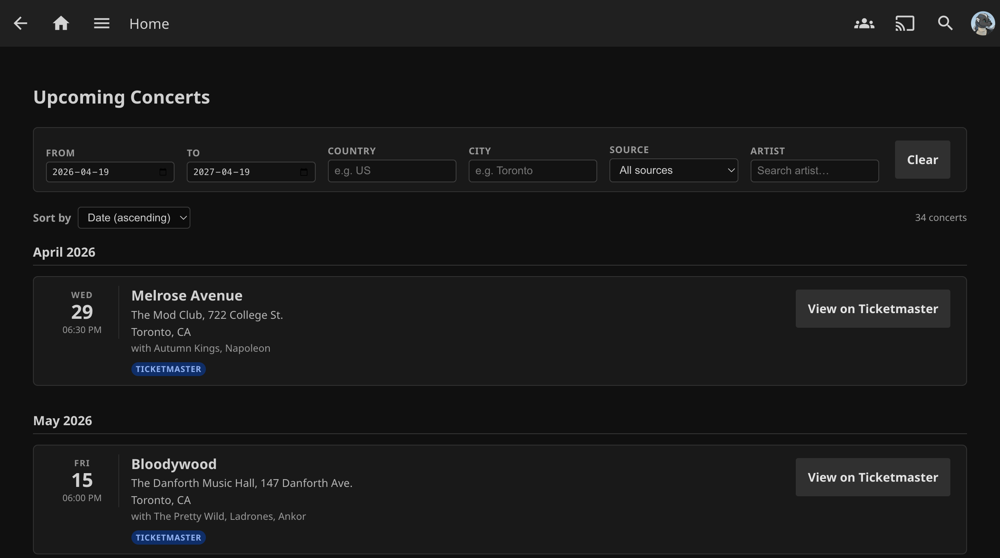
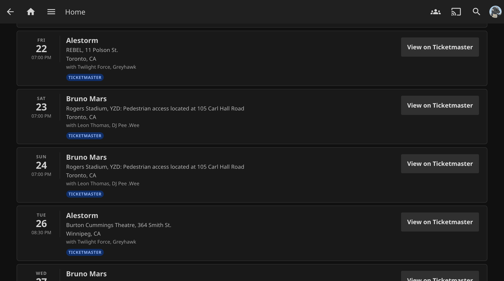

# Concert Radar — User & Admin Manual

A walkthrough of configuring, navigating, and using Concert Radar. Start with [Admin setup](#admin-setup) on a fresh install, then share the [User guide](#user-guide) with your Jellyfin users.

> **Before you start:** finish the [Installation](README.md#installation) section of the README. This manual assumes Concert Radar, File Transformation, and Plugin Pages are all installed and Jellyfin has been restarted.

---

## Table of contents

- [Admin setup](#admin-setup)
  - [1. Open the admin page](#1-open-the-admin-page)
  - [2. Enter API credentials](#2-enter-api-credentials)
  - [3. Enable sources](#3-enable-sources)
  - [4. Set geographic filters](#4-set-geographic-filters)
  - [5. Tune the scheduler](#5-tune-the-scheduler)
  - [6. Adjust rate limits](#6-adjust-rate-limits)
  - [7. Save and run](#7-save-and-run)
- [Monitoring](#monitoring)
  - [Status cards](#status-cards)
  - [Run Now / Purge / Reset](#run-now--purge--reset)
- [User guide](#user-guide)
  - [Opening the concerts page](#opening-the-concerts-page)
  - [Reading a concert card](#reading-a-concert-card)
  - [Filtering and sorting](#filtering-and-sorting)
- [Troubleshooting](#troubleshooting)

---

## Admin setup

### 1. Open the admin page

**Dashboard → Plugins → Concert Radar → Settings.**

The admin page opens with the status bar at the top and configuration sections below.

### 2. Enter API credentials

Scroll to the **Credentials** section.

- **Ticketmaster API Key** — get one from [developer.ticketmaster.com](https://developer.ticketmaster.com/). Free tier: 5000 requests/day, 5 requests/second.
- **Bandsintown App ID** — self-assigned string, any URL-safe identifier (e.g. `concert-radar-<your-server>`). No signup required.
- **EdmTrain API Key** — request access from [edmtrain.com/api](https://edmtrain.com/api). Manual approval required. Attribution is mandatory (the plugin renders an attribution badge on every EdmTrain-sourced card).

Leave any field blank to disable that source.

### 3. Enable sources

In the **Sources** section, toggle the sources you want to use. The three official API sources require their respective credentials. The three scrape sources each have a Terms of Service checkbox you must accept first.

- **Ticketmaster** / **Bandsintown** / **EdmTrain** — official APIs, safe for production use within their free tiers.
- **Songkick** — HTML scrape of public concert pages.
- **Dice.fm** — extracts `__NEXT_DATA__` JSON from Dice's Next.js bundles. Cloudflare may intermittently block the scraper.
- **Resident Advisor** — reverse-engineered GraphQL endpoint. **Default OFF.** Repeated scraping may get your server's IP blocked. Use sparingly.

The scrape toggles remain disabled until you tick the matching **I accept the ... scrape terms of service** checkbox. The plugin never scrapes a source you haven't opted into.

### 4. Set geographic filters

Scroll to the **Filters** section.

- **Locations** — add at least one row. City name is required; region and country (ISO-3166 alpha-2) are recommended. Optional GPS lat/lon + radius (km) enables distance-based filtering for Ticketmaster's geo-search. Without any location rows, every result is returned unfiltered.
- **Country Allowlist** — comma-separated alpha-2 codes. Leave blank to allow all countries.
- **Genre Allowlist** — comma-separated genre names. Leave blank to allow all genres.
- **Min Days Ahead / Max Days Ahead** — date window. Defaults: `0` / `365`.
- **Skip festival events** / **Skip sold-out events** — off by default.

### 5. Tune the scheduler

- **Max Artists Per Run** (default 50). How many artists a single run processes. Set to your library size for full sweeps, or a smaller number to spread load across multiple runs.
- **Daily API Call Limit (per source)** (default 500). Hard cap per source per day. Keeps you under provider quotas (e.g. Ticketmaster's 5000).
- **Delete Unseen Concerts After (days)** (default 14). Concerts not seen by the source in this window are pruned — handles cancellations / lineup changes.
- **Circuit Breaker Threshold** (default 5). Consecutive failures before a source is disabled.
- **Circuit Breaker Cooldown (hours)** (default 24). How long a disabled source stays off.

### 6. Adjust rate limits

The **Rate Limits** table shows one row per source.

- **Req / sec** — token-bucket rate limit enforced by the plugin before every request. Defaults respect each source's published limit.
- **Req / day** — blank means unlimited. Works alongside the Scheduler's per-source daily cap.

Changes take effect on the next scheduled run.

### 7. Save and run

Click **Save** at the bottom. Then hit **Run Now** at the top to trigger the scheduled task immediately — otherwise it runs daily at 03:00 server time.

---

## Monitoring

### Status cards

Each enabled source has a card showing:

- Health badge — `OK` (green), `Degraded` (yellow), `Failing` (red), `Disabled` (circuit breaker open), or `Unconfigured` (missing credentials).
- **Last success** — timestamp of the most recent successful request.
- **Calls today** — API calls consumed against the daily budget.
- **Disabled until** — end of the current circuit breaker cooldown, if tripped.
- **Reset** button — manually clears circuit breaker state and zeroes daily call counters for that source.

The top status bar shows:

- **Last run** — when the scheduled task last completed.
- **Next run** — when the next automatic run will fire (derived from the Daily trigger at 03:00).
- **Queue** — artists in the library that have never been checked. Drains as runs progress; a value of 0 means every artist has been queried at least once.

### Run Now / Purge / Reset

- **Run Now** — queues an immediate run of the scheduled task. Safe to hit any time; uses the same daily budget and rate limits as scheduled runs.
- **Purge All Concerts** — wipes every stored concert record. The next run re-fetches everything. Use if data looks corrupted or after a major config change.
- **Reset** (per source) — clears a single source's failure counter + daily call count. Use after fixing a credential or waiting out a rate-limit ban.

---

## User guide

### Opening the concerts page

Any logged-in Jellyfin user can open the concerts list. In the **web client**, click the hamburger icon (top-left) to open the sidebar drawer. Scroll the drawer down past `Home`, `Media`, `Administration`, `User` — you'll find the **Plugin Settings** section.

Click **Concerts**. The concerts listing opens.

> **Mobile and TV apps** don't show this menu entry (Plugin Pages only patches the web bundle). Users on those clients can still bookmark `https://<your-server>/web/#/configurationpage?name=concertradar-view`, but that URL requires admin permissions in Jellyfin 10.11.

### Reading a concert card

Each card shows:

- **Left** — day of week, day number, showtime.
- **Middle** — artist name (linked to the artist's Jellyfin page when a Jellyfin artist ID was resolved), venue + address, city + country. Supporting acts appear on a `with …` line when available. Price range when the source provides it.
- **Source pill** — which provider reported the event. EdmTrain cards also show a mandatory `Data: EdmTrain` attribution.
- **Right** — `View on <Source>` button (opens the provider's event page in a new tab) and, when distinct, a separate `Buy Tickets` button with the direct ticket URL.

The list is grouped by calendar month when sorted by date, with a month header (`April 2026`, `May 2026`, etc.) above each group.

### Filtering and sorting

The filter bar at the top of the page supports:

- **From / To** — date range. Defaults to today through the next 365 days.
- **Country** — ISO-3166 alpha-2 code; autocomplete suggests codes seen in current results.
- **City** — free-text substring match.
- **Source** — dropdown populated from the sources the admin enabled.
- **Artist** — autocomplete from the artist list. Matching is only by MusicBrainz ID resolved by the plugin — typing a name that doesn't match a known artist in your library falls back to "all artists".

Filters update the list live (300 ms debounce after the last keystroke). Click **Clear** to reset all filters to defaults.

The **Sort by** dropdown supports:

- **Date (ascending)** — default; enables the month header grouping.
- **Artist** — alphabetical by artist name; no month grouping.
- **City** — alphabetical by city name; no month grouping.

Large result sets paginate at 50 concerts per page. Use the **Prev** / **Next** buttons below the list.

---

## Troubleshooting

### "Concerts" menu entry doesn't appear

1. Check `Dashboard → Plugins` — confirm `File Transformation`, `Plugin Pages`, and `Concert Radar` are all **Active**.
2. Confirm the three plugins' ABIs match your Jellyfin version. Mismatch shows up as `Failed` plugin status.
3. Hard-refresh the browser (`Cmd-Shift-R` / `Ctrl-Shift-R`). Jellyfin's service worker may cache the old `index.html`.
4. Open the hamburger drawer and **scroll to the bottom** — the entry lives under a `Plugin Settings` section header, below `Home`, `Media`, `Administration`, `User`.

### Status shows "—" for Last run / Next run / Queue

Usually means the scheduled task hasn't completed yet. Click **Run Now** and wait a minute. If it stays `—`, check Jellyfin logs (`/var/log/jellyfin/jellyfin<date>.log`) for `RefreshConcertsTask` errors.

### A source is stuck "Failing" or "Disabled"

1. Click the source's **Reset** button.
2. If it fails again within minutes, the credential is likely expired — re-enter it in the Credentials section.
3. For Dice.fm specifically, HTTP 403 is usually Cloudflare; the block typically lifts within hours. Just leave the source disabled and re-enable later.

### No concerts appearing after a run finishes

1. Check **Queue** in the status bar — non-zero means the task hasn't reached your artists yet. Run again (or wait for the next daily trigger).
2. Check the Country Allowlist + Location filters — an overly restrictive combination may be filtering every result out.
3. Check individual source health cards — if all say `Unconfigured`, you need to add API keys.

### After a Jellyfin upgrade, the sidebar entry is gone

Expected behavior. File Transformation and Plugin Pages both ship one build per Jellyfin release. Wait for [IAmParadox27](https://github.com/IAmParadox27) to publish matching builds, then upgrade both prerequisites. Concert Radar itself works in all Jellyfin 10.11.x versions without a rebuild.
