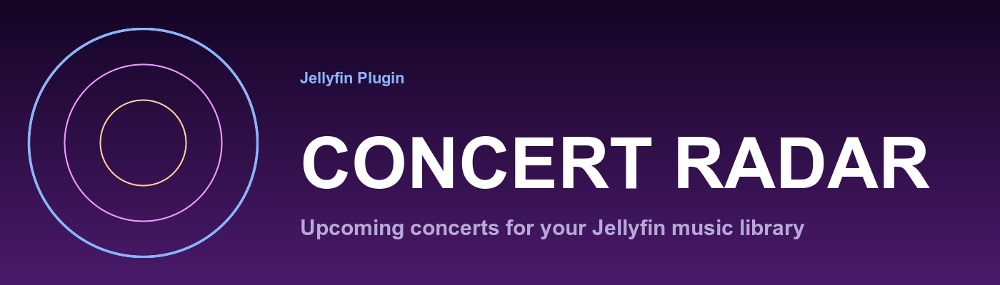

<p align="center">
  
</p>

# Jellyfin Concert Radar

A Jellyfin server plugin that aggregates upcoming concerts for every artist in your music library from multiple external sources, normalizes them into a single canonical schema, and surfaces them in both an admin dashboard and a user-accessible concert list inside the Jellyfin web client.

The plugin runs a scheduled task that round-robins your artists through six data sources (three official APIs, three opt-in web scrapers), stores normalized events in a private SQLite database, and exposes them via REST endpoints consumed by the embedded admin and user views. Each event keeps a direct link back to its source page and, when distinct, a buy-tickets link so users can jump straight to purchase.

## Screenshots

**Sidebar entry** — every logged-in user gets a `Concerts` link under the `Plugin Settings` section of the web client hamburger drawer (requires the Plugin Pages prerequisite; see [Installation](#installation)).


**User-facing concerts list** — month-grouped, chronological, filterable by date range / country / city / source / artist.


**Admin status page** — per-source health, last/next run, queue size, run-now, purge, rate-limit controls.


**Admin source toggles + ToS gates** — enable each data source, accept the scrape terms of service for opt-in sources.


## Features

- **Six concert sources** — Ticketmaster, Bandsintown, EdmTrain (official APIs), plus Songkick, Dice.fm, Resident Advisor (opt-in scrapers, ToS-gated).
- **MusicBrainz artist resolution** — extracts per-source external IDs from MBID URL relationships so each artist is matched reliably across providers.
- **Round-robin scheduler with circuit breakers** — every artist is refreshed over time without overloading any source; a source that fails repeatedly is disabled for a cooldown window.
- **Per-source daily API call limits** — hard caps respect provider quotas (e.g. Ticketmaster 5000/day).
- **Geographic + genre filters + skip festivals / sold-out** — every match is filtered server-side before storage.
- **Month-grouped user view** — chronological list, filter by date/country/city/source/artist, direct links to source event pages and ticket URLs.
- **Admin dashboard** — source health cards, run/purge controls, rate-limit editor, ToS opt-ins.
- **No live network calls in tests** — 135+ unit / integration / contract tests use temp-file SQLite and stub HTTP handlers.

## Requirements

- **Jellyfin 10.11.x** (production-tested on 10.11.6). The plugin ships per-ABI builds.
- **.NET 9** (plugin target framework — your Jellyfin server already ships this runtime).

## Installation

### 1. Install Concert Radar

**From a plugin repository (recommended once released):**

1. **Dashboard → Plugins → Repositories → Add**.
2. Name: `Concert Radar`. URL: the `manifest.json` URL published with each release.
3. **Catalog → Concert Radar → Install**.
4. Restart Jellyfin.

**Manual install (any build):**

```bash
# On the Jellyfin server:
sudo systemctl stop jellyfin
sudo mkdir -p /var/lib/jellyfin/plugins/ConcertRadar_0.1.0.0/
sudo unzip jellyfin-concert-radar_0.1.0.0.zip -d /var/lib/jellyfin/plugins/ConcertRadar_0.1.0.0/
sudo chown -R jellyfin:jellyfin /var/lib/jellyfin/plugins/ConcertRadar_0.1.0.0/
sudo systemctl start jellyfin
```

Confirm listed under **Dashboard → Plugins**.

### 2. Prerequisites for the user-facing sidebar entry (strongly recommended)

Concert Radar's admin configuration page is accessible out of the box. The **user-facing `Concerts` entry in the web client sidebar** is implemented through the [`Plugin Pages`](https://github.com/IAmParadox27/jellyfin-plugin-pages) framework (by [IAmParadox27](https://github.com/IAmParadox27)), because Jellyfin core exposes no plugin API for non-admin user navigation.

Install both prerequisite plugins:

1. **Dashboard → Plugins → Repositories → Add** with URL `https://www.iamparadox.dev/jellyfin/plugins/manifest.json`.
2. In the catalog, install these in order:
   - `File Transformation` (choose the version whose `targetAbi` matches your Jellyfin version)
   - `Plugin Pages` (same ABI match)
3. Restart Jellyfin.

Concert Radar writes its Plugin Pages registration on every startup — the `Concerts` menu entry appears automatically once all three plugins are loaded.

> **Jellyfin manifest has no inter-plugin dependency field.** These prerequisites cannot be auto-installed with Concert Radar; the admin must install them manually.
>
> **Per-Jellyfin-version ABI.** `File Transformation` and `Plugin Pages` ship one build per Jellyfin release. After a Jellyfin upgrade, wait for matching prerequisite releases before the sidebar entry reappears. If either is absent, Concert Radar's admin page still works and the plugin keeps scanning; only the user-facing menu is skipped.

### 3. Upgrade

1. Stop Jellyfin.
2. Replace the DLL in `/var/lib/jellyfin/plugins/ConcertRadar_<version>/`. The SQLite database at `/var/lib/jellyfin/data/concertradar/concerts.db` carries across versions; migrations run automatically on startup.
3. Start Jellyfin.

### 4. Uninstall

1. Stop Jellyfin.
2. Delete `/var/lib/jellyfin/plugins/ConcertRadar_*/`.
3. Optional: delete `/var/lib/jellyfin/data/concertradar/` to drop cached concerts.
4. Start Jellyfin.

## Configure

**Dashboard → Plugins → Concert Radar** opens the admin settings page. See [`MANUAL.md`](MANUAL.md) for a full walkthrough (configuration, navigation, usage) with screenshots, and [`CONFIGURATION.md`](CONFIGURATION.md) for the per-setting reference with defaults, allowed ranges, and trade-offs.

Quick start:

1. Enter API keys for the sources you want to use (Ticketmaster, Bandsintown, EdmTrain).
2. Tick the matching source toggles. For scrape sources (Songkick, Dice.fm, Resident Advisor), accept the ToS checkbox first.
3. Add at least one **Location** (city + country + optional GPS + radius) to scope results.
4. Save, then **Run Now** — or wait for the daily 03:00 scheduled refresh.

## Using the plugin

### As an end user

Open the web client hamburger drawer → scroll to **Plugin Settings → Concerts**. The view:

- Defaults to the next 365 days.
- Sorts by date ascending; date sort renders month headers (e.g. `April 2026`, `May 2026`) above each group.
- Filters update the list live (300 ms debounce).
- Each card links out to the source event page, plus a separate `Buy Tickets` button when the source provides a distinct ticket URL.

Clicking an artist name navigates to the matching Jellyfin artist page when the plugin successfully resolved a `JellyfinArtistId`.

### As an admin

**Dashboard → Plugins → Concert Radar** surfaces:

- Status bar (last run, next run, queue size) + source cards with live health badges.
- `Run Now` (queues the scheduled task immediately) and `Purge All Concerts` (wipes the DB; next run re-fetches everything).
- Per-source `Reset` button to clear circuit breaker state manually.
- Credentials, source toggles with ToS gates, geographic/genre filters, scheduler, and rate limits.

## Sources

| Source | Access | Requires | Notes |
|---|---|---|---|
| Ticketmaster | Official API | Free API key | 5000 req/day, 5 req/s |
| Bandsintown | Official API | Self-assigned `app_id` | MBID-native artist identifier |
| EdmTrain | Official API | API key (manual approval) | EDM-only; attribution required |
| Songkick | HTML scrape | ToS opt-in | SSR HTML; stable selectors |
| Dice.fm | HTML scrape | ToS opt-in | Next.js `__NEXT_DATA__` extraction; Cloudflare-sensitive |
| Resident Advisor | GraphQL scrape | ToS opt-in | Reverse-engineered; default OFF |

Scrape adapters (Songkick, Dice, Resident Advisor) rely on non-public methods. Enable only after reviewing each source's terms of service for your deployment.

## Architecture

Two phases:
- **Ingest** (scheduled task, daily at 03:00): enumerates music-library artists → resolves MusicBrainz URL relationships → queries each enabled source through rate-limited adapters → normalizes results → upserts into SQLite.
- **Surface**: admin + user views call the plugin's own REST endpoints under `/Plugins/ConcertRadar/api/` (user reads use `[Authorize]`; admin writes use `[Authorize(Policy = RequiresElevation)]`).

Source adapters share a common `ISourceAdapter` contract. A circuit breaker disables a source after repeated failures and re-enables it after a cooldown. The scheduler runs round-robin over artists so every artist is eventually refreshed without overloading any provider.

See [`SPEC.md`](SPEC.md) for the full architecture, schema, and adapter contract.

## Known limitations

- **No per-user configuration.** Jellyfin doesn't support per-user plugin config; all users see the same concerts.
- **User sidebar entry requires 3rd-party plugins.** Jellyfin core has no plugin API for user-facing navigation; see [Prerequisites](#2-prerequisites-for-the-user-facing-sidebar-entry-strongly-recommended). Without them, the view is still reachable at `https://<your-jellyfin>/web/#/configurationpage?name=concertradar-view`, but only by admins.
- **Mobile / TV clients don't show the sidebar entry.** Plugin Pages patches the web bundle only; native apps are unaffected. Users on mobile/TV clients can still use the admin URL above.
- **Terms of service.** Ticketmaster / Bandsintown / EdmTrain permit non-commercial use only. Check each source's terms for your deployment.
- **Scrape drift.** Songkick, Dice, and Resident Advisor are scraped. HTML / JSON shapes change; contract tests catch drift in CI but breakage can still happen between releases.
- **Cloudflare on Dice** may block scrapes with HTTP 403. The circuit breaker disables the source; re-enable from the admin page after the block lifts.

## Build from source

Requirements:
- [.NET 9 SDK](https://dotnet.microsoft.com/download/dotnet/9.0) (9.0.115 or later).
- `git` and a POSIX shell.
- Optional for release packaging: Python 3.10+ and [`jprm`](https://github.com/oddstr13/jellyfin-plugin-repository-manager) (`pip install jprm`).

macOS (keg-only Homebrew formula):

```bash
brew install dotnet@9
export DOTNET_ROOT="$(brew --prefix)/opt/dotnet@9/libexec"
export PATH="$(brew --prefix)/opt/dotnet@9/bin:$PATH"
```

Clone, restore, build, test:

```bash
git clone https://github.com/<owner>/jellyfin-concert-radar.git
cd jellyfin-concert-radar
dotnet restore
dotnet build --configuration Release
dotnet test  --configuration Release
```

Package a release zip (same format the manifest-based install consumes):

```bash
pip install jprm
jprm plugin build . --version 0.1.0 --output ./artifacts
# → ./artifacts/jellyfin-concert-radar_0.1.0.0.zip
```

## Develop

Tests use temp-file SQLite and stub HTTP handlers — no live network calls. Fixtures live under `tests/fixtures/`. Sub-agent definitions for Claude Code are in `.claude/agents/` (backend, frontend, tests).

See [`TASKS.md`](TASKS.md) for the implementation backlog and [`TESTS.md`](TESTS.md) for the test plan.

## License

MIT — see [`LICENSE`](LICENSE).
